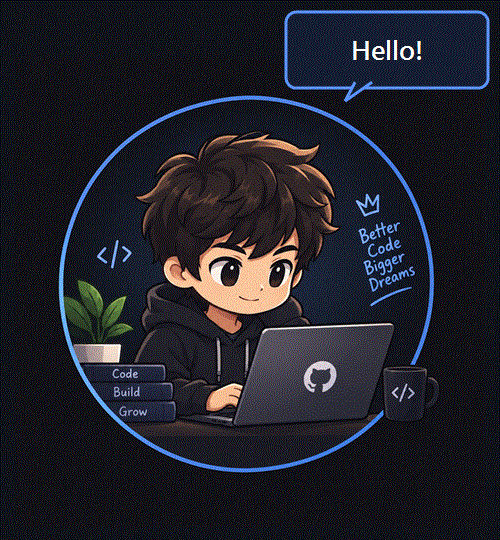
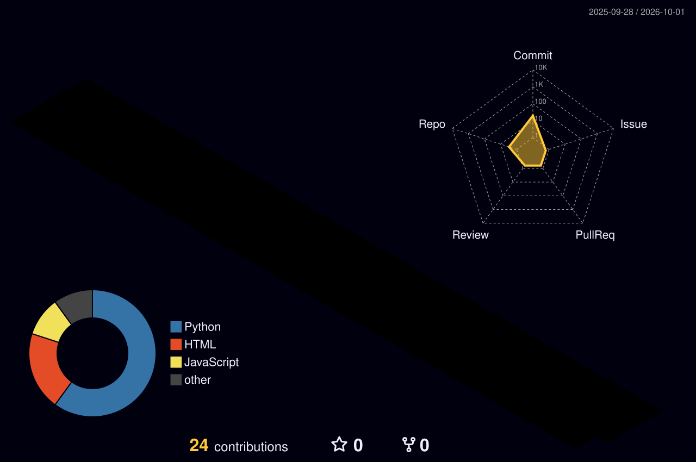

<!-- ═══════════════ HEADER ═══════════════ -->
<div align="center">


<a href="https://github.com/Dheeraj-st">
  
</a>

<br/>


</div>

<br/>

<div align="center">
  
</div>

<br/>

## 🧠 About me

```text
> name      : Dheeraj Chauhan
> status    : struggler, still shipping
> motto     : "I'll learn until my last..."
> focus     : C++, DSA, CI/CD pipelines, cloud security
> learning  : Basic AI/ML, Docker, Jenkins
```

<br/>

## 🛠️ Tools I build with

<div align="center">


<br/><br/>

<br/><br/>


</div>

<br/>

## 🧊 My 3D contribution city

<div align="center">

<!-- Auto-generated by .github/workflows/profile-3d.yml on every push + daily -->


</div>

<br/>

## 📊 Profile at a glance

<div align="center">


<br/>


</div>

<br/>

## 🚀 Featured builds

| Project | What it is | Stack |
| :-- | :-- | :-- |
| **CI/CD Pipeline** | Automated build, test and deploy pipeline | Jenkins · Docker · GitHub Actions |
| **Cloud Threat Detection System** | Detects suspicious activity in cloud environments | Python · Cloud · Security |

> 🔗 Replace each project name with a link to its repo once you want it clickable, e.g. `[CI/CD Pipeline](https://github.com/Dheeraj-st/REPO-NAME)`.

<br/>

## 🐍 Contribution snake

<div align="center">

<picture>
  <source media="(prefers-color-scheme: dark)" srcset="https://raw.githubusercontent.com/Dheeraj-st/Dheeraj-st/output/github-snake-dark.svg" />
  <source media="(prefers-color-scheme: light)" srcset="https://raw.githubusercontent.com/Dheeraj-st/Dheeraj-st/output/github-snake.svg" />
  
</picture>

</div>

<br/>

## 🤝 Let's connect

<div align="center">

<a href="https://github.com/Dheeraj-st"></a>

<br/><br/>

<i>Always learning, always building. 💜</i>


</div>
